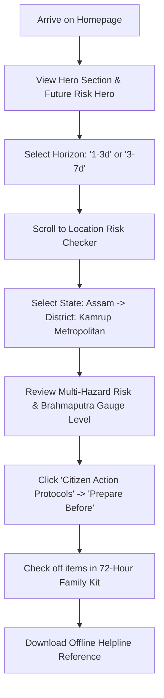
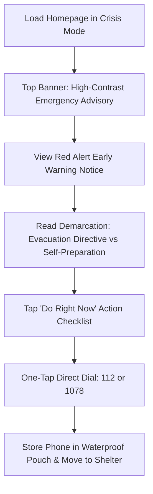

# CITIZEN USER JOURNEYS
## End-to-End Walkthroughs: Calm Preparedness & Imminent Crisis

**Document Version**: 2.0.0  
**Status**: APPROVED  
**Date**: September 2026  
**Audience**: Product Designers, Civil Defense Planners, Engineering Teams  

---

### Persona Archetypes

The RISK // INDIA platform serves two primary citizen archetypes with vastly differing cognitive states, bandwidth constraints, and time horizons:

```
+-------------------------------------------------------------------------+
|                              RISK // INDIA                              |
+------------------------------------+------------------------------------+
|   ARCHETYPE A: PREPARED CITIZEN     |     ARCHETYPE B: CRISIS CITIZEN    |
|   (Calm, Planning, High Bandwidth) |   (High Stress, Low Battery, Fast) |
+------------------------------------+------------------------------------+
| • Investigating home district       | • Torrential rain / gale winds     |
| • Assembling 72-hour family kit    | • Mobile battery at 18%            |
| • Reviewing seasonal hazard trends | • Intermittent 2G/3G network       |
| • Saving emergency numbers         | • Needs immediate "WHAT DO I DO?"  |
+------------------------------------+------------------------------------+
```

---

### Journey A: The Prepared Citizen (Calm Horizon Planning)

#### User Profile
- **Name**: Ananya Sharma (34, Teacher & Parent)
- **Location**: Guwahati, Kamrup Metropolitan, Assam
- **Context**: Onset of monsoon season; wants to understand local river gauge trends and prepare family in advance.
- **Device**: Mid-range Android smartphone on home Wi-Fi.

#### Step-by-Step Flow



1. **Discovery & Assessment**:
   - Ananya opens the homepage. The headline `"Know the Risk. Prepare Before It Matters."` and the top pill `"CURRENT RISK • FUTURE RISK • EARLY WARNING • ACTION"` immediately confirm that future projections are available.
   - She looks at the `FutureRiskHeroSection` and clicks the **`1-3d`** horizon tab. The system updates instantaneously to show `ELEVATED` flood watch with `INCREASING` trend, noting upstream catchment rainfall.

2. **Hyperlocal Precision**:
   - Ananya clicks `"Check Risk for My Location"`.
   - In `LocationRiskCheckerSection`, she selects **State: Assam**, **District: Kamrup Metropolitan**, **City: Guwahati**.
   - The card reflects live data: CWC Brahmaputra gauge stage, IMD 24h rainfall telemetry, and explicitly displays the empirical ML flood indicator (strictly enabled for Assam Brahmaputra monitoring gauges).
   - Ananya notes that uncertainty is `MODERATE` for the 24-hour horizon and `HIGH` for the 3-day horizon, giving her realistic expectations.

3. **Concrete Mitigation**:
   - Ananya scrolls down to `CitizenActionSection` and selects the **`Prepare Before`** tab. She reads clear guidelines: elevating household electronics, inspecting rooftop stormwater gutters, and securing duplicate identity documents.
   - She clicks the **`72-Hour Family Kit`** tab. Working with her children, they check off drinking water containers, first aid supplies, torch batteries, and cash reserves. Progress counter displays `6 / 8 packed`.

4. **Outcome**:
   - Ananya departs the site within 4 minutes with complete situational awareness, no alarmist panic, and tangible physical preparations in place.

---

### Journey B: The Crisis Citizen (Imminent Hazard & Life Threat)

#### User Profile
- **Name**: Rajesh Patel (48, Small Shopkeeper)
- **Location**: Puri District, Coastal Odisha
- **Context**: Very Severe Cyclonic Storm approaching coast; power grid has cut out, heavy rain drumming on roof, phone at 14% battery.
- **Device**: Low-cost smartphone, spotty 2G mobile data.

#### Step-by-Step Flow



1. **Emergency Landing & High Contrast**:
   - Rajesh navigates to RISK // INDIA. The platform auto-detects low network throughput or Rajesh toggles **Crisis Mode** in the navbar.
   - All particle animations, background canvases, and decorative gradients instantly disengage. The UI shifts to high-contrast, black-and-white typography with stark red/amber hazard badges.
   - Page load takes under 0.8 seconds.

2. **Immediate Threat Triage**:
   - At the top of the screen, the `EarlyWarningNoticeSection` displays an active **IMD Red Cyclone Warning** for Coastal Odisha.
   - The prominent callout box explicitly clarifies:  
     *“District Collectorate has ordered mandatory evacuation for low-lying coastal villages within 5 km of shoreline. Do not remain in kutchha houses.”*
   - Rajesh immediately understands this is not just advice—it is an official civil evacuation order.

3. **Urgent Life-Safety Directives**:
   - In `CitizenActionSection`, the default tab is **`Do Right Now`**:
     1. *Charge phone and battery bank immediately before substation outage.*
     2. *Fill clean water vessels.*
     3. *Grab waterproof pouch containing Aadhaar cards and cash.*
     4. *Turn off main electrical breaker and LPG gas cylinder valve.*
     5. *Move to nearest designated cyclone shelter.*

4. **Direct Telephony Escalation**:
   - At the bottom of the section, the persistent high-contrast emergency dial bar allows Rajesh to tap **`112 (National Emergency)`** or **`1078 (NDRF Disaster)`** with a single thumb-press, triggering his phone's native dialer without needing internet connectivity.

5. **Outcome**:
   - Rajesh secures his household, turns off utilities, and evacuates to the pucca village school shelter with his family and documents in under 15 minutes, preserving life and health.
