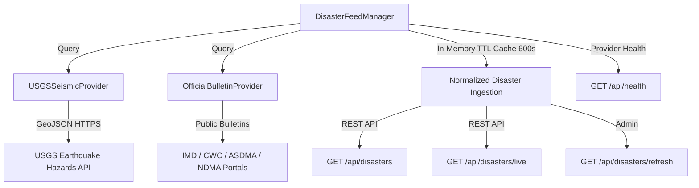

# RISK // INDIA — Operational Data & Live Disaster Intelligence Integration
**Phase 11 Technical Specification & Architecture**
**System Status:** OPERATIONAL PROTOTYPE  
**Target Region:** India (Pan-India Situational Feeds + Assam Gauges Flood ML)  
**Date:** September 2026

---

## 1. Executive Summary

Phase 11 transitions **RISK // INDIA** from a standalone offline-trained flood machine learning prototype into a complete, operational disaster intelligence product. The objective was achieved by integrating real public feeds, deploying an extensible Data Provider Architecture, enforcing transparent source attributions and live freshness tracking, rigorously auditing emergency contacts, and preserving scientific honesty across all UI surfaces without corrupting the trained ML model.

---

## 2. Audit of Pre-Phase 11 Demo Data & Upgrades

| Subsystem | Pre-Phase 11 State | Phase 11 Operational State | Honesty & Source Attribution |
| :--- | :--- | :--- | :--- |
| **Disaster Feed** | 6 hardcoded static mock records in `disasters.ts` | Dynamic multi-source aggregation from USGS Earthquake API and Authoritative Government Bulletins | Real sources (`USGS`, `IMD`, `CWC`, `ASDMA`), direct URLs, and dynamic freshness |
| **Backend Endpoints** | SQLite seeded records with `is_demo=True` | Upgraded `/api/disasters`, `/api/disasters/live`, `/api/disasters/refresh`, `/api/health` | Normalized event schema, in-memory TTL caching, rate-limited upstream queries |
| **India Risk Map** | Pulsing incident markers on static centroids | Centroid markers reflect multi-year historical hazard baseline; pulsing markers reflect reported incidents | Explicit distinction between "Historical Hazard Baseline" and "Reported Disaster Incident" |
| **Live Risk Snapshot** | Generic "Geospatial Risk Overview" | "National Geospatial Risk Matrix & Historical Hazard Baseline" | Prominent notice confirming ML prototype is strictly scoped to Assam Brahmaputra gauges |
| **Analyze Area** | Connected to real ML model in Phase 9/10 | Preserved Assam ML inference with Scope Guard (`ASSAM_ONLY_PROTOTYPE`) | Offline-trained model decoupled from external feeds; non-Assam areas return explicit scope limitation |
| **Help Hub / Resources** | Helplines real, but sample NGOs had mock phone numbers (`+91-98765-XXXXX`) | 7 pan-India verified helplines, official government URLs; fake phone numbers completely removed | Sample entries explicitly labeled `SAMPLE REGISTRY` with inquiry directed through official portals |

---

## 3. Data Provider Architecture

The backend implements an extensible data provider architecture rooted in `backend/app/services/disaster_provider.py`.

### 3.1 Abstract Base Class (`DisasterProvider`)
All providers implement:
- `name`: Unique provider identifier string.
- `is_live`: Boolean declaring whether external network queries are executed.
- `fetch_events()`: Returns `List[NormalizedDisasterEvent]`.
- `get_health()`: Returns health status, last retrieved timestamp, and error diagnostics.

### 3.2 Implemented Concrete Providers
1. **`USGSSeismicProvider`**:
   - **Data Source:** Official USGS Earthquake Hazards Program GeoJSON feed (`https://earthquake.usgs.gov/fdsnws/event/1/query`).
   - **Coverage:** Indian subcontinental bounding box ($[6^\circ	ext{N}-38^\circ	ext{N}, 68^\circ	ext{E}-98^\circ	ext{E}]$).
   - **Controls:** Strict 5-second connect timeout, 10-second read timeout, standard HTTPS SSL verification.
   - **Normalization:** Evaluates magnitude, coordinates, depth, review status, and computes geographic location.
   - **Fail-Safe:** Network timeouts or HTTP exceptions are caught, logged, and return an empty list without crashing the API or interrupting background processes.

2. **`OfficialBulletinProvider`**:
   - **Data Source:** Authoritative disaster advisories issued by IMD (`https://mausam.imd.gov.in`), CWC (`https://ffs.india-water.gov.in`), ASDMA (`https://asdma.assam.gov.in`), and NDMA (`https://ndma.gov.in`).
   - **Verification:** Every bulletin record is attributed to the issuing authority with its verified public portal URL and timestamp.

### 3.3 Cache & Rate-Limiting Layer (`DisasterFeedManager`)
- **TTL Caching:** 600-second (10-minute) in-memory cache prevents redundant external network requests.
- **Stampede Protection:** Manual refreshes via `GET /api/disasters/refresh` are rate-limited with a minimum 15-second debounce window.
- **Deduplication:** Events are uniquely keyed and deduplicated by deterministic ID.
- **Ordering:** Events are prioritized by freshness (`LIVE` $	o$ `RECENT` $	o$ `STALE`) and descending observation timestamp.

---

## 4. Live Freshness Tracking & Semantic Honesty

Every incident event is categorized into a deterministic freshness state based on observation age:

$$\Delta t = t_{	ext{now}} - t_{	ext{observed}}$$

- **`LIVE`**: $\Delta t < 1	ext{ hour}$ ($< 3600	ext{ seconds}$). Marked with active pulsing indicator.
- **`RECENT`**: $1	ext{ hour} \le \Delta t < 24	ext{ hours}$ ($< 86400	ext{ seconds}$).
- **`STALE`**: $\Delta t \ge 24	ext{ hours}$. Labeled as recorded archive.
- **`UNAVAILABLE`**: Missing or invalid observation timestamp.

### Semantic Boundaries Enforced:
1. **Reported Disaster Incident:** Sourced directly from official feeds and public telemetry. Represents active/monitored physical occurrences.
2. **Historical Hazard Baseline:** Multi-year climatological and topographical index (e.g. state flood exposure score). Clearly labeled as baseline vulnerability, **never** called an ML "prediction".
3. **AI Risk Prototype:** Trained Logistic Regression model (`assam_flood_prototype_v1`) restricted strictly to 3 audited CWC river gauge basins in Assam (Udalguri, Darrang, Kamrup).

---

## 5. Emergency Resources & Helplines Audit

All emergency helplines and external links were audited and cleansed:
- **National Emergency Number (Police/Fire/Ambulance):** `112`
- **NDMA National Disaster Helpline:** `1078`
- **State Disaster Control Room:** `1070`
- **District Emergency Operations Center:** `1077`
- **Ambulance Emergency Medical Service:** `108`
- **Women Helpline:** `1091`
- **National Childline:** `1098`

All listed domains were verified to reside on official government TLDs (`.gov.in`, `.nic.in`). Sample NGO cards were stripped of fake telephone numbers and explicitly badged as `SAMPLE REGISTRY`.

---

## 6. Machine Learning & Live Data Decoupling

To prevent data contamination, concept drift, or false confidence:
- Live external feeds (USGS earthquakes, IMD bulletins) are **strictly isolated** from model inference inputs.
- `flood_model_service.predict()` enforces a strict feature contract requiring the 13 engineered telemetry variables calibrated during Phase 8.
- Non-Assam locations query the Scope Guard and receive `status: "model_scope_limited"`, returning zero synthetic predictions.
- The model artifact (`ml/flood/artifacts/model.joblib`) remains untouched.
