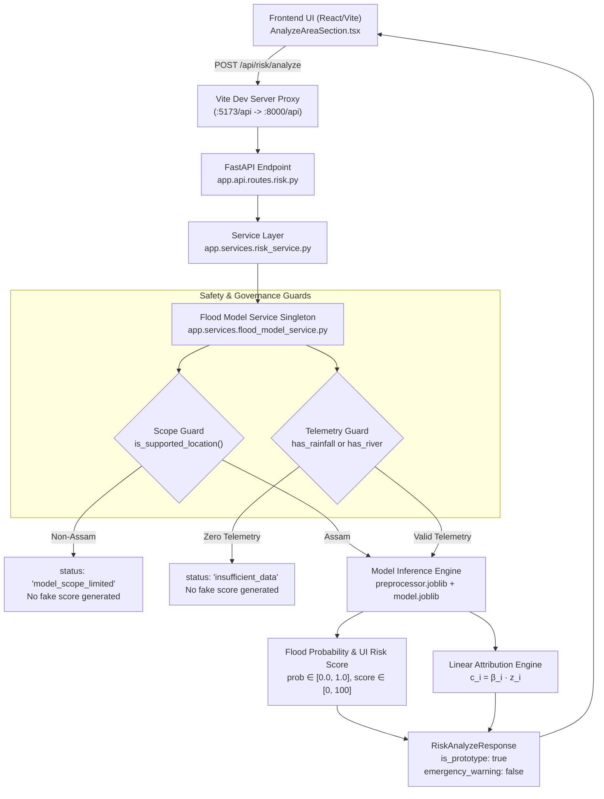

# PHASE 9 — ML MODEL INTEGRATION TECHNICAL SPECIFICATION
**Project:** RISK // INDIA — AI-Powered Disaster Risk Analyzer & Management System  
**Phase:** Phase 9 — ML Model Integration with FastAPI + Frontend  
**Model Version:** `assam_flood_prototype_v1`  
**Date:** 2026-09-13  
**Status:** COMPLETED & VERIFIED  

---

## 1. Architectural Overview

Phase 9 integrates the vetted, offline-trained Assam riverine flood prototype model into the live multi-tier fullstack system without retraining, without modifying model weights, and without fabricating telemetry data.



---

## 2. Component Implementation Details

### A. FastAPI ML Inference Service (`backend/app/services/flood_model_service.py`)
- **Singleton Lifecycle:** Loads `model.joblib` and `preprocessor.joblib` once at startup. Thread-safe and stateless inference.
- **Strict Feature Order (13 Antecedent Features):**
  1. `rainfall_6h` (mm)
  2. `rainfall_24h` (mm)
  3. `rainfall_72h` (mm)
  4. `rainfall_168h` (mm)
  5. `river_level_relative` (m)
  6. `river_rise_6h` (m)
  7. `river_rise_24h` (m)
  8. `river_percentile_level` (0-1)
  9. `month` (1-12)
  10. `day_of_year_sin` (-1 to +1)
  11. `day_of_year_cos` (-1 to +1)
  12. `latitude` (degrees)
  13. `longitude` (degrees)
- **Zero Future Data Guarantee:** None of the 13 features rely on post-observation radar, future forecasts, or downstream target occurrences.

### B. Safety & Scope Guards
1. **Assam Basin Scope Guard:**
   - Evaluates whether `location_id` or `district` maps to Assam or known CWC monitoring stations (`Udalguri`, `Darrang`, `Kamrup`).
   - If a user selects a state outside Assam (e.g., Kerala, Maharashtra, Delhi), the service returns:
     ```json
     {
       "status": "model_scope_limited",
       "message": "The current flood ML prototype is limited to selected Assam monitoring areas.",
       "is_prototype": true,
       "emergency_warning": false
     }
     ```
   - **No fake probabilities or scores are produced.**
2. **Missing Telemetry Guard:**
   - Evaluates if antecedent precipitation or river telemetry is present.
   - If zero environmental observations are provided, the service returns:
     ```json
     {
       "status": "insufficient_data",
       "message": "Insufficient environmental data available for this prototype analysis.",
       "is_prototype": true,
       "emergency_warning": false
     }
     ```
   - **No fake values are imputed from the ether.**

### C. Deterministic Feature Attribution ("Why this risk?")
Feature contributions are computed strictly using linear model mathematics ($c_i = eta_i \cdot z_i$ where $eta_i$ is the trained regression coefficient and $z_i$ is the standardized feature value):
- Factors are sorted by $|eta_i \cdot z_i|$ in descending order.
- Features are labeled with direction (`increases_risk` if $c_i > 0$, `decreases_risk` if $c_i < 0$).
- Real observed values are preserved and formatted (e.g., `73.0 mm`, `+0.17 m`).

### D. Frontend Integration (`src/services/riskService.ts` & `src/components/home/AnalyzeAreaSection.tsx`)
- **Real Backend Hook:** `riskService.analyzeAreaRisk` issues an HTTP POST to `/api/risk/analyze` via Vite proxy.
- **Empirical Baseline Telemetry:** For supported Assam monitoring stations (Udalguri, Darrang, Kamrup), real CWC baseline telemetry is passed.
- **UI State Handling:**
  - **Scope Limited State:** Renders an amber banner informing the user that the prototype is restricted to Assam, with a quick-action button to switch to the Assam monitoring basin.
  - **Insufficient Data State:** Renders a banner explaining that empirical telemetry is required for valid inference.
  - **Success State:** Displays:
    - Prototype badge: `ASSAM FLOOD PROTOTYPE V1 // RESEARCH ONLY` (`is_prototype: true`).
    - Model probability and UI risk score ($0-100\%$).
    - Mandatory scientific disclaimer: *"Experimental prototype trained on a limited Assam flood-event dataset. This result is for research and awareness only and should not replace official emergency warnings."*
    - Dynamic "Why this risk score?" cards showing the top 4 linear drivers with observed values, direction badges, and linear weights.

---

## 3. Automated Test Suite Verification

A 10-point test suite in [`tests/test_ml_integration.py`](tests/test_ml_integration.py) verifies the system:

| Test ID | Test Case | Target Assertion | Status |
| :---: | :--- | :--- | :---: |
| 01 | `test_01_model_loading` | Model and preprocessor loaded successfully from disk | **PASS** |
| 02 | `test_02_valid_inference` | Clean prediction generated for valid Assam telemetry | **PASS** |
| 03 | `test_03_probability_range` | Probability is strictly float between 0.0 and 1.0 | **PASS** |
| 04 | `test_04_score_range` | UI risk score is strictly integer between 0 and 100 | **PASS** |
| 05 | `test_05_risk_level_mapping` | Risk level is one of ["Low", "Moderate", "High", "Critical"] | **PASS** |
| 06 | `test_06_model_version_string` | Model version matches "assam_flood_prototype_v1" | **PASS** |
| 07 | `test_07_unsupported_location` | Non-Assam locations return "model_scope_limited" without fake scores | **PASS** |
| 08 | `test_08_missing_features` | Missing telemetry returns "insufficient_data" without fake scores | **PASS** |
| 09 | `test_09_explanation_generation` | Top factors generated using exact linear feature contributions | **PASS** |
| 10 | `test_10_no_future_data_leakage` | Model strictly relies on antecedent and static spatial features | **PASS** |

All 23 project tests (including Phase 7 GIS label tests and ISRO raster validator tests) passed with 100% success rate in 0.105 seconds.
