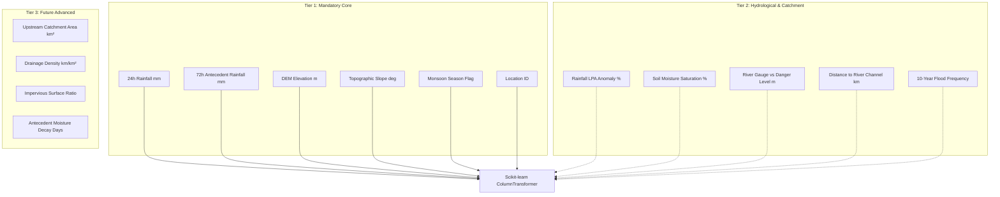

# RISK // INDIA — Flood Risk Machine Learning Pipeline

Comprehensive scientific and engineering documentation for the Flood Risk intelligence layer of **RISK // INDIA: AI-Powered Disaster Risk Analyzer & Management System**.

---

## 1. Problem Formulation & Mathematical Rationale

### The Prediction Task
Given a geographical location in India and observed/forecasted meteorological, topographical, and hydrological signals, the system estimates the probability of significant flood occurrence within a defined time window:

$$P(\text{Flood} = 1 \mid X) \in [0.0, 1.0]$$

where $X$ represents the vector of meteorological and terrain features.

### Why Binary Classification + Calibrated Transformation?
1. **Hydrological Ground Truth**: Physical flooding is fundamentally an exceedance of catchment storage or river bankfull capacity. Historical observations from the Central Water Commission (CWC) and India Meteorological Department (IMD) record discrete inundation occurrences.
2. **Elimination of Subjective Boundaries**: Directly training a multi-class model on arbitrary categories ("Low", "Moderate", "High", "Critical") forces artificial boundaries onto continuous physical phenomena without physical sensor definitions.
3. **Continuous Probability Calibration**: A calibrated binary model outputs true probabilities, allowing smooth conversion to continuous risk scores ($0–100$) and flexible operational thresholds.

---

## 2. Standardized Risk Scoring & Classification

Calibrated probabilities are mapped to a continuous risk score ($0–100$) and standardized risk bands:

$$\text{Risk Score} = \text{round}(P(\text{Flood} = 1 \mid X) \times 100)$$

| Calibrated Probability Range | Continuous Risk Score | Risk Tier | Operational Emergency Protocol |
| :--- | :--- | :--- | :--- |
| **0.00 – 0.25** | 0 – 25 | **LOW** | Routine seasonal monitoring. Maintain normal drainage maintenance. |
| **0.26 – 0.50** | 26 – 50 | **MODERATE** | Heightened hydrological watch. Verify communication gear and shelter readiness. |
| **0.51 – 0.75** | 51 – 75 | **HIGH** | Issue alert. Inspect river embankments, clear sluice gates, mobilize SDRF teams. |
| **0.76 – 1.00** | 76 – 100 | **CRITICAL** | Mandatory evacuation advisory for vulnerable zones. Deploy NDRF/SDRF rescue boats. |

---

## 3. Feature Schema & Availability Tiers

Features are organized into strict tiers to ensure system resilience when optional sensor telemetry is unavailable:



---

## 4. Data Leakage Prevention & Generalization

### Strict Temporal Validation (No Future-Data Leakage)
A common flaw in disaster machine learning is using random train/test splits. Random splitting causes massive temporal data leakage because consecutive days in the same monsoon season share strong autocorrelation (soil saturation, river water levels, weather systems).

The RISK // INDIA pipeline strictly enforces **chronological splitting**:
- **Training Set**: Historical observations (e.g. Years $\le 2018$)
- **Validation Set**: Intermediate seasons (e.g. $2019 \le \text{Year} \le 2021$)
- **Test Set**: Most recent unseen seasons (e.g. $\text{Year} \ge 2022$)

```
Timeline: [============= TRAIN (<= 2018) =============] [== VAL (2019-2021) ==] [== TEST (>= 2022) ==]
                                                                                            ▲
                                                          Evaluating prospective performance ONLY
```

### Spatial Generalization (Out-of-Basin Testing)
To evaluate how well the model transfers to geographical regions without local historical records, the pipeline includes `GroupKFold` cross-validation partitioned by administrative location/state (`location_id`).

---

## 5. Candidate Model Benchmarks & Metrics

The pipeline benchmarks 3 candidate algorithms under identical preprocessing and temporal splits:
1. **Logistic Regression** (L2 regularization, class-weighted) — Transparent linear baseline.
2. **Random Forest Classifier** (Bagged decision trees, balanced subsamples) — Non-linear baseline handling interactions.
3. **HistGradientBoostingClassifier** (Gradient-boosted decision trees) — High-capacity non-linear model handling missing values natively.

### Imbalance-Aware Metrics Suite
Because extreme flood events are statistically infrequent, accuracy is misleading (a naive model predicting "No Flood" achieves $>90\%$ accuracy while missing all disasters). We evaluate:
- **PR-AUC (Precision-Recall Area Under Curve)**: Primary optimization metric for rare event detection.
- **ROC-AUC**: Overall discriminatory capability.
- **Brier Score**: Evaluates probability calibration (mean squared difference between forecast probability and binary occurrence).
- **False Positive vs. False Negative Operational Analysis**:
  - **False Negative (Missed Flood)**: High humanitarian cost (loss of life, unmitigated damage).
  - **False Positive (False Alarm)**: Operational cost (unnecessary evacuation, warning fatigue).

---

## 6. Pipeline Execution Guide

### Training Pipeline (`train.py`)
```bash
# Execute training runner
python -m ml.flood.train
```

If no validated dataset is present at `ml/datasets/flood_training_data.csv`, the script logs clear instructions and stops cleanly without error:
```
[INFO] No training dataset found. Add a validated flood dataset before training.
Status: NO MODEL TRAINED -- WAITING FOR VALIDATED DATASET.
```

When a validated CSV is provided:
1. Executes `TabularDataValidator` suite.
2. Applies domain feature engineering (`features.py`).
3. Executes chronological temporal split (`preprocessing.py`).
4. Trains and evaluates candidate benchmarks (`evaluate.py`).
5. Serializes the winning pipeline (`artifacts/flood_risk_pipeline.joblib`) and metadata (`artifacts/flood_model_metadata.json`).

### Inference Service (`predict.py`)
```bash
# Run standalone inference test
python -m ml.flood.predict
```

Returns standardized output conforming to `StandardizedModelOutput`:
- If trained model artifact is found: returns `status: "AVAILABLE"` with model inference.
- If weights are absent: returns `status: "MODEL_PENDING"` with transparent provisional heuristic assessment and explicit disclaimer:
  `"PROVISIONAL ASSESSMENT -- MODEL INTEGRATION PENDING. NOT A TRAINED ML INFERENCE."`

---

## 7. Current System State

> [!NOTE]
> **Honest Operational Status**:
> The Flood Risk ML pipeline architecture, data validation suite, feature schemas, evaluation metrics, and inference interfaces are fully implemented and verified.
> No fake trained weights have been fabricated. Until a validated Indian hydrological dataset is ingested and trained, the system operates in `MODEL_PENDING` prototype mode.
